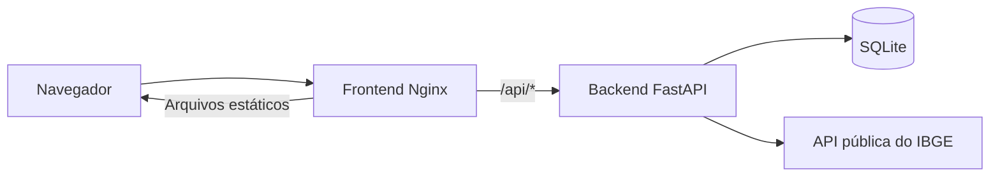

# População em Jogo - frontend

Interface web do jogo **População em Jogo**. O jogador escolhe Brasil, região ou estado, recebe uma cidade sorteada e tenta estimar sua população com tolerância de +/-5%.

A interface conversa somente com a API própria. O backend consulta o IBGE, persiste a partida no SQLite e controla o histórico.

## Arquitetura



O projeto possui três módulos comunicantes:

1. Interface React/Vite servida pelo Nginx.
2. API FastAPI desenvolvida para o projeto.
3. API pública do IBGE, consultada pelo backend.

## Tecnologias

- React 19 para construir a interface.
- Vite 8 para desenvolvimento e build.
- Lucide React para os ícones.
- Vitest, Testing Library e jsdom para testar a interface.
- Nginx para servir o build de produção
- Docker Compose para a execução integrada

## Pré-requisitos

Para usar os scripts auxiliares e a execução integrada, instale o [Docker Desktop](https://docs.docker.com/desktop/setup/install/windows-install/) e inicie-o em modo de containers Linux. No Windows, use o backend WSL 2; se ele não estiver disponível, habilite a virtualização na BIOS/UEFI, execute `wsl --install` no PowerShell como administrador e reinicie o computador. Se o WSL já estiver instalado mas desatualizado, execute `wsl --update` ([instruções oficiais](https://learn.microsoft.com/windows/wsl/install)). Confirme que o daemon responde antes de executar o Compose:

```powershell
docker version
docker compose version
docker info --format '{{.OSType}}'
```

O último comando deve retornar `linux`. Se `docker version` mostrar somente o cliente e falhar ao acessar o servidor, inicie o Docker Desktop. As portas 8000 e 8080 devem estar livres. Python e Node.js não precisam estar instalados no host para a execução em containers; as imagens incluem as versões necessárias.

## Clonagem dos repositórios

Instale o Git e, em uma pasta que conterá os dois projetos, clone os repositórios públicos com os nomes locais indicados:

```powershell
git clone https://github.com/mgarnier/popemjogo-front mvp-front
git clone https://github.com/mgarnier/popemjogo-api mvp-back
```

A estrutura local deve ficar assim:

```text
<pasta-pai>/
    mvp-front/
    mvp-back/
```

Os diretórios `mvp-front` e `mvp-back` precisam estar no mesmo nível: o Docker Compose e os scripts da API usam esses caminhos para encontrar o outro módulo. Se já tiver clonado os projetos, confira os nomes e a posição das pastas antes de executar os scripts.

## Execução com scripts (recomendada)

No PowerShell, a partir da raiz do frontend:

```powershell
.\build.ps1
.\run.ps1
.\test.ps1
```

`build.ps1` constrói apenas a imagem do frontend; é opcional antes de `run.ps1`, que constrói e inicia frontend e backend em segundo plano e aguarda os serviços ficarem prontos. `test.ps1` reconstrói a imagem de testes do frontend e executa apenas seus testes, retornando erro se falharem. Para testar o backend, use o script de testes no repositório da API. O terminal fica livre após `run.ps1`.

- Interface: <http://localhost:8080>
- Swagger da API: <http://localhost:8000/docs>

## Execução local sem Docker

Para executar diretamente no host, instale Node.js e npm e use:

```powershell
npm ci
npm test
```

Para iniciar o servidor Vite:

```powershell
npm run dev
```

Durante o desenvolvimento, o proxy do Vite encaminha `/api` para `http://localhost:8000`.

Para executar a API localmente, use os scripts equivalentes no repositório <https://github.com/mgarnier/popemjogo-api>.

## Execução com Docker Compose

Como alternativa aos scripts, o Compose está neste repositório e usa o backend clonado lado a lado a partir de <https://github.com/mgarnier/popemjogo-api>:

```powershell
docker compose config
docker compose build
docker compose up -d --build --wait frontend backend
docker compose ps
```

Endereços publicados:

- Interface: <http://localhost:8080>
- API: <http://localhost:8000>
- Swagger: <http://localhost:8000/docs>
- Healthcheck: <http://localhost:8000/api/v1/health>

Para executar os testes nos containers:

```powershell
docker compose --profile test run --build --rm backend-test
docker compose --profile test run --build --rm frontend-test
```

Para acompanhar os logs:

```powershell
docker compose logs -f backend frontend
```

Para parar os serviços sem apagar o banco:

```powershell
docker compose down
```

Para remover também o volume SQLite, somente quando essa perda for intencional:

```powershell
docker compose down -v
```

O frontend usa chamadas relativas para `/api`. Em produção, o Nginx encaminha essas chamadas para o serviço `backend` na rede interna do Compose.

## Fluxo do jogo

1. O navegador cria ou reutiliza um UUID anônimo em `localStorage`.
2. A interface carrega regiões e estados pela API própria.
3. O jogador escolhe Brasil, região ou estado.
4. O backend consulta dados atuais do IBGE e sorteia um município.
5. A interface mostra o município e a UF, mas mantém a população em segredo.
6. O jogador envia palpites inteiros não negativos.
7. O palpite é aceito quando está dentro da tolerância inclusiva de +/-5%.
8. A interface revela a população em caso de acerto ou desistência.
9. As partidas encerradas aparecem no histórico do jogador.

## Testes

Os testes do frontend são determinísticos e não chamam a API real:

```powershell
.\test.ps1
```

A suíte cobre o cliente HTTP, UUID, headers, métodos, erros, seleção de escopo, partida, feedback, vitória, desistência, histórico e confirmação de limpeza.

## Limitações

- O UUID do navegador identifica anonimamente o jogador, mas não é autenticação.
- Limpar os dados do navegador cria outro identificador e não recupera o histórico anterior.
- Não há cadastro, login, ranking global, multiplayer ou exclusão individual de partidas.
- A interface depende da disponibilidade da API própria e, indiretamente, do IBGE.
- A fonte externa pode apresentar latência ou indisponibilidade.

## Repositório relacionado

O backend está em <https://github.com/mgarnier/popemjogo-api> e possui seu próprio README, Dockerfile e scripts auxiliares.
